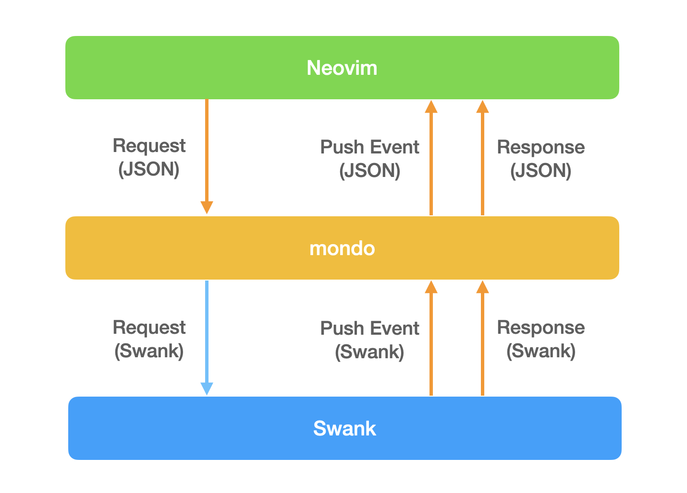

# mondo

This is a simple Common Lisp REPL, just like SLIME REPL that works on terminal.
It's not intended to achieve the same behavior, but it aims to provide its functionality outside of Emacs.

Not only evaluating Lisp forms in the REPL, it also relays the communication with a Swank server between different protocol servers over TCP. See [Editor Integration](#editor-integration) for the detail.

## Prequisite

* [Roswell](https://github.com/roswell/roswell)
* [GNU Readline](https://tiswww.case.edu/php/chet/readline/rltop.html)

## Features

* Basic REPL functions
  * Complete function/macro names
  * Show an argument list
  * Keep input history
* Run a Lisp implementation by name and version
* Connect to a running Swank server
* TCP server to relay between a Swank server and editors
  * Currently, only Vlime (Vim/Neovim) is supported

## Installation

### Install GNU Readline

For Debian/Ubuntu users, install `libreadline-dev` via apt:

```
$ apt install libreadline-dev
```

For macOS users, install `readline` via Homebrew:

```
$ brew install readline
```

If your Mac works with M1 chip, Homebrew installs under different directory, so the following steps will be additionally required:

```
$ sudo mkdir -p /usr/local/opt/readline/lib
$ sudo ln -s  /opt/homebrew/opt/readline/lib/* /usr/local/opt/readline/lib
```

### Install Roswell

See [Roswell's installation guide](https://github.com/roswell/roswell/wiki/Installation).

### Install mondo

```
$ ros install fukamachi/mondo
```

Be sure that `~/.roswell/bin` is added to `PATH`.

## Usage

```
$ mondo --help
Usage: mondo [OPTIONS...] [DIRECTORY]

OPTIONS:
    -L, --lisp [NAME]
        Run the specific Lisp implementation (Default: sbcl-bin)
    -S, --source-registry [SOURCE REGISTRY]
        Overwrite source registry of ASDF with the argument
    -Q, --quicklisp [QUICKLISP HOME]
        Use the different Quicklisp home from the default one.
        Would be useful when using Qlot.
    -h, --host [NAME]
        Hostname of the running Swank server to connect to
    -p, --port [PORT]
        Port of the running Swank server to connect to
    --server [TYPE]
        Start a server to communicate with external tools such as editors
    --no-color
        Disable colors
    --version
        Print version
    --help
        Print this message
    --debug
        Print debug logs

ARGUMENTS:
    DIRECTORY
        Optional. If specified, REPL will be started assuming that directory is the project root.
        The directory path is added to ASDF source registry, and use its local Quicklisp if exists.
        ex) `mondo .` is approximately equivalent to `mondo -S . -Q ./.qlot`.
```

### Quickstart

The simplest use case is to use REPL in Terminal.

```
$ mondo
SBCL 2.1.7 running at 127.0.0.1:50476 (pid=484434)
CL-USER>
```

If a directory path is given, REPL will be started assuming that directory is the project root.

```
$ cd /path/to/project
$ mondo .
SBCL 2.1.7 running at 127.0.0.1:50006 (pid=484668)
Project root: /path/to/project/
CL-USER>
```

ASDF systems in the directory are implicitly accessible by ASDF and Quicklisp. If `.qlot/` directory exists, mondo loads the project-local Quicklisp dist.

### Editor Integration

Mondo allows editors that can't accept Swank protocol to take advantage of Swank's powerful features through mondo.



#### Vlime (Vim/Neovim)

Run `mondo` in Vlime server mode to communicate with Vlime.

```
$ mondo --server vlime
Server created: (#(127 0 0 1) 50550)
SBCL 2.1.7 running at 127.0.0.1:50006 (pid=485312)
CL-USER>
```

When you see the REPL running, invoke `<LocalLeader>cc` on Vim/Neovim, and connect to the indicated port number (50550 in this case).

A more sophisticated way to do this is to set up the following configurations, run an editor, and then run `<LocalLeader>rr`.

```vimscript
nnoremap <silent> <LocalLeader>rr :call VlimeStart()<CR>
let g:vlime_cl_impl = "mondo"
let g:vlime_cl_use_terminal = v:true

function! VlimeBuildServerCommandFor_mondo(vlime_loader, vlime_eval)
    return ["mondo", "--server", "vlime"]
endfunction

function! VlimeStart()
    call vlime#server#New(v:true, get(g:, "vlime_cl_use_terminal", v:false))
endfunction
```

## Other

### Input history

Input history is stored under `~/.mondo/history` (or `$XDG_DATA_HOME/mondo/history` if it's set).

## License

GNU General Public License v3.0
